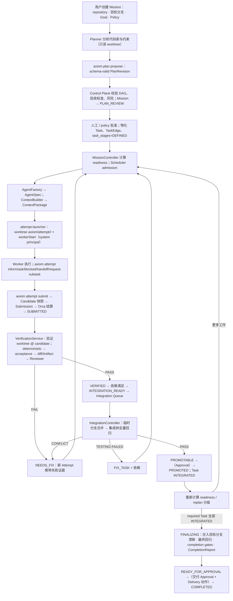

# Axiom：自主软件工程控制平台 · 整体架构 V1.1

更新日期：2026-09-26
基于：整体设计 V1（2026-09-26）；代码审计快照 `stablyai/orca@646e9a5`（Orca 1.4.197），**fork 冻结基线 `3eb1adec2`（tag `axiom-base`，D19）**，审计结论已在基线上复核，见 `docs/reference/orca-mapping.md`
仓库落位：`docs/ARCHITECTURE.md`
术语与枚举以 `docs/GLOSSARY.md` 为准；决策编号见 `docs/decisions/DECISION_LOG.md`（D1–D8 已拍板；D6a、D7a 为对已拍板决策的修正提议；D9 起为提议中）。

## 1. 产品定义

Axiom 是一个**目标驱动的自主软件工程控制平面**。用户为一个 repository 创建一个 **Mission**，给出目标、约束与验收要求；系统负责：

1. 理解目标与现有代码库；
2. 生成并维护版本化计划（PlanRevision）；
3. 把计划转化为带依赖的 Task DAG；
4. 为每个 Task 动态生成 AgentSpec 与 ContextPackage；
5. 调度 Claude Code、Codex、Gemini、OpenCode 等执行者；
6. 管理隔离的 worktree、终端、会话与上下文；
7. 独立验证每一次提交；
8. 串行集成通过验证的候选；
9. 在失败、阻塞或目标变化时重新规划；
10. 在高风险节点请求人工决策或批准；
11. 以可恢复、可审计的方式推进 Mission 直至有证据的完成。

一句话定位：

> 把软件工程目标转化为持久化计划与任务图，动态组织专业 AI Agent，并通过独立验证、受控集成和人工治理完成交付。

## 2. 我们解决的不是「多开几个 Agent」

Orca 已经解决了昂贵的执行问题：终端、PTY、Git worktree、Agent CLI、SSH、WSL、远端运行时、进程状态、浏览器与桌面工作台，以及一套 orchestration 原语（Run、Task、Dispatch、worker、message、decision gate、federation）。

但 Orca 的编排语义是「Worker 说完成就完成」：`worker_done` 在同一事务把 Task 置 `completed` 并解锁下游任务；自动 coordinator 已退役，现在的 coordinator 是终端里跟 skill guide 的 LLM。Axiom 的差异正在于**项目级闭环**：

```text
Goal
  → Repository Understanding
  → Versioned Plan
  → Task DAG
  → Agent Organization
  → Execution
  → Independent Verification
  → Controlled Integration
  → Replanning
  → Evidence-backed Completion
```

因此产品不是：多 Agent 聊天室；Coding Agent launcher；依赖一个永不退出的 Master Agent；让 Worker 自己宣布完成的脚本；把全部上下文塞进同一个 conversation。

## 3. 最高层设计原则

12 条不可协商的不变量在 `docs/PROJECT_CONSTITUTION.md`。本节只解释它们在架构上的含义。

### 3.1 LLM proposes; the Control Plane decides and persists
LLM 负责开放式推理和提出方案；确定性 Control Plane 负责校验、授权、持久化和状态转换。LLM 不直接改权威状态、绕过依赖、宣布验证通过、合并分支、扩大权限或预算、创建子 Agent。

### 3.2 Task lifetime > Agent lifetime
Task 是长期存在的工作对象；Agent 只是某次 Attempt 的临时执行者。Attempt 可以崩溃、重试、换 provider，Task 的身份、依赖、验收标准与历史不变。

### 3.3 Worker completion ≠ verified completion
Worker 的 `SUBMISSION` 只能把 Task 推进到 `SUBMITTED`。`VERIFIED`、`INTEGRATION_READY`、`INTEGRATED` 只能由 VerificationService 与 IntegrationController 产生。

### 3.4 一个 Task 只有一个权威 stage
项目级权威是 `task_stages.stage`（D2）。Orca `tasks.status` 是 Attempt 执行投影，其 `completed` 的含义是「当前 Attempt 已结算」，不是「任务完成」。Task DAG 只存于 `mission_task_edges`，不使用 Orca `tasks.deps`（D10，提议中）。

### 3.5 Typed messages，而不是无限聊天
八种消息类型（`INFORM / REQUEST / QUESTION / DECISION / BLOCKED / HANDOFF / REQUEST_SUBTASK / SUBMISSION`），摘要在消息里、正文在 Artifact 里，按对象关系与订阅路由，不广播。

### 3.6 单一权威写入路径
UI、CLI、Mission Intelligence、Worker 都通过 `axiom.*` Runtime RPC 进入 Control Plane。任何模块不得绕过 service 层写编排数据库；renderer 不启动 shell。

### 3.7 风险分级升级
低风险、高置信度选择走规则或 DecisionEngine；复杂判断交给 specialist LLM（advisory）；架构变化、权限提升、发布与不可逆操作交给人类（Approval）。

### 3.8 Control Plane 可重启
所有调度、队列与等待都从数据库派生；没有内存态调度器，也没有必须长驻的 LLM 会话。

## 4. 整体架构

```mermaid
flowchart TD
  UX["Mission Experience Layer\nMission Home · Plan & DAG · Evidence · Approvals"]
  INTEL["Mission Intelligence\nPlanner · Architect · Reviewer · Replanner"]
  DEC["DecisionEngine\nRulesEngine · optional Jev · LLM fallback"]
  CTRL["Control Plane\nMissionController · Scheduler · AgentFactory · ContextBuilder\nMessageRouter · VerificationService · IntegrationController\nApprovalGateway · RecoveryService · AuditLog"]
  EXEC["Orca-derived Execution Kernel\nRPC · worktree · PTY · Git · remote"]
  WORKERS["Workers\nClaude Code · Codex · Gemini · OpenCode"]

  UX -->|axiom.* RPC| CTRL
  CTRL -->|schema-bound prompts| INTEL
  INTEL -->|schema-valid proposals| CTRL
  CTRL --> DEC
  DEC -->|advisory| CTRL
  CTRL -->|workerStart / worktree / send| EXEC
  EXEC --> WORKERS
  WORKERS -->|axiom attempt * (capability)| CTRL
  EXEC -->|liveness · run mailbox| CTRL
  CTRL --> UX
```

### 4.1 Mission Experience Layer
面向人的界面与操作入口：创建 Mission、输入目标与约束；审阅计划；查看 DAG、进度、风险、证据；处理 Question 与 Approval；必要时进入终端、编辑器、diff 工作台。UI 不是状态权威，只是 Control Plane 的投影；每个乐观更新都必须与 Control Plane 对账。

### 4.2 Mission Intelligence
由 frontier reasoning model 承担不适合硬编码的开放式工作：需求理解、代码库分析、架构设计、计划与里程碑生成、Task DAG proposal、验收标准 proposal、失败根因分析、大范围 replanning、语义 review、完成度语义审查。四个角色：**Planner、Architect、Reviewer、Replanner**。

运行方式：通过与 Worker 相同的 provider 适配层启动（优先 Claude/Codex 的结构化会话适配器），在只读 worktree 中工作，输出必须是 schema-valid proposal，经 `axiom.plan.propose` / `axiom.decision.propose` 等命令进入 Control Plane。V1 不引入独立的 API key 管理——复用用户已有的 provider 配置。

### 4.3 DecisionEngine
为封闭候选集合提供快速选择、评分、分类和排序：

```ts
interface DecisionEngine {
  choose(input: ChoiceRequest): Promise<ChoiceResult>
  score(input: ScoreRequest): Promise<ScoreResult>
  classify(input: ClassifyRequest): Promise<ClassifyResult>
  rank(input: RankRequest): Promise<RankResult>
}
```

实现：RulesEngine（基线，必备）、Jev（可选 typed decision model，V1 之后实验）、小型 classifier、frontier-LLM fallback。适用：provider 路由、context 候选排序、事件路由、replan 分级、风险分级。输出是 advisory，除非确定性 policy 明确授权在给定置信度与风险等级下自动执行。它不能替代依赖检查、权限判断、测试结果和审批规则。

### 4.4 Control Plane
系统的权威核心，主要是确定性代码，不是超级 Agent。服务与职责见术语表 §2；本文 §6–§15 逐一展开。落位 `src/main/axiom/`（D12），只通过 RPC 方法注册与 service 边界接入 runtime。

### 4.5 Orca-derived Execution Kernel
复用：`OrcaRuntimeService` 与 Runtime RPC；PTY、daemon、terminal persistence；Git 与 worktree；provider adapters 与 agent hooks；SSH、WSL、relay、远端运行时（V1 之后启用）；agent status；文件、diff、browser/computer 能力；orchestration 的 Run（仅作容器与 `run:<runId>` mailbox）、dispatch/worker 生命周期、messages/deliveries/唤醒、dispatch capability、decision gate（仅 Task 级 QUESTION）、federation。

**不复用**：已退役的自动 Coordinator 循环与 `coordinator_runs`；`promoteReadyTasks` 作为依赖权威；decision gate 作为 Approval。

Execution Kernel 只回答「在哪里、以什么进程和工作区执行」，不决定 Mission 应该做什么。

### 4.6 Worker Plane
Claude Code、Codex、Gemini、OpenCode 等是可替换的临时执行者。Worker 接收 ContextPackage，在授权 worktree 内执行，通过 `axiom attempt <verb>` 发出类型化消息与 SUBMISSION；heartbeat 由执行内核维持，不是产品消息。

## 5. 核心领域对象

完整定义、权威归属与 Orca 基础见术语表 §3 与 `docs/reference/orca-mapping.md` §2。这里只给对象关系图：

```text
Mission ──1:1── Orca Run（容器 / mailbox）
  ├── GoalRevision*（一个 ACTIVE）
  ├── PlanRevision*（一个 APPROVED；含 Milestone 分组）
  │     ├── Task*（tasks + task_stages）
  │     └── TaskEdge*（mission_task_edges）
  ├── Task
  │     ├── Attempt*（≡ Orca dispatch）── AgentSpec、ContextPackage
  │     │     └── Submission（不可变）── Candidate（commit/tree）── Artifact*
  │     └── VerificationRun*（按 Candidate）
  ├── IntegrationBatch*（V1 每批一个 Candidate）
  ├── Decision*、Approval*、Question*、Message*
  ├── Policy（Mission 级）
  ├── AuditEvent*（只追加）
  └── CompletionReport（Artifact）
```

与 V1 相比的实质变化：顶层对象 Project → Mission（D1）；新增 GoalRevision、TaskEdge、Submission、Candidate、Policy 为显式对象；Milestone 降为 PlanRevision 内的分组标签；Attempt 不新建表（`attemptId ≡ dispatchId`）。

## 6. 权威状态机

枚举值以术语表 §4 为准；本节给出转换条件与副作用。

### 6.1 Mission

```text
DRAFT → ANALYZING → PLAN_REVIEW → PLANNED → EXECUTING → FINALIZING → READY_FOR_APPROVAL → COMPLETED
EXECUTING ↔ REPLANNING
任一非终态 → PAUSED（可恢复到前一状态）/ BLOCKED / FAILED / CANCELED
```

| 转换 | 条件 / 副作用 |
|---|---|
| `DRAFT → ANALYZING` | Mission 已绑定 repository 与目标分支，GoalRevision ACTIVE；启动 Planner |
| `ANALYZING → PLAN_REVIEW` | `axiom.plan.propose` 写入 PROPOSED PlanRevision |
| `PLAN_REVIEW → PLANNED` | PlanRevision APPROVED（人工或 policy 自动）；物化 Task、TaskEdge、`task_stages=DEFINED` |
| `PLANNED → EXECUTING` | 用户启动或 policy 自动启动；Scheduler 开始 admission |
| `EXECUTING → REPLANNING` | Replan 分级为 `MAJOR_REPLAN`；暂停新 admission，活跃 Attempt 按 policy 继续或停止 |
| `REPLANNING → EXECUTING` | 新 PlanRevision APPROVED，旧 revision SUPERSEDED，Task 继承/取消/重绑完成 |
| `EXECUTING → FINALIZING` | 所有 required Task ∈ {`INTEGRATED`, `CANCELED`}，无活跃 Attempt |
| `FINALIZING → READY_FOR_APPROVAL` | 目标分支漂移已合入集成基线并通过最终全量回归；completion gate 全部通过；CompletionReport 生成 |
| `READY_FOR_APPROVAL → COMPLETED` | 交付 Approval GRANTED（或 policy 不要求）；集成基线合入目标分支（Delivery）成功 |
| `* → BLOCKED` | Mission 级阻塞：未解决的 blocking Question / Decision / Approval，或预算耗尽 |
| `* → FAILED` | 无安全有界恢复路径且用户放弃；须记录原因 |

集成在 `EXECUTING` 期间持续发生（每个 VERIFIED 候选即时入队），`FINALIZING` 只是最终回归与完成门评估。

### 6.2 GoalRevision 与 PlanRevision

```text
GoalRevision: PROPOSED → ACTIVE → SUPERSEDED
PlanRevision: PROPOSED → APPROVED → SUPERSEDED ; PROPOSED → REJECTED
```

- 用户直接编写的 Goal 创建即 ACTIVE；Planner 提出的 Goal 修正为 PROPOSED，用户接受后 ACTIVE。Goal 变更 = `MAJOR_REPLAN` 触发。
- 任一时刻只有一个 APPROVED PlanRevision。新 revision 批准时，对旧 Task 逐个记录处理方式：`inherit`（同一 Task 继续，stage 不变）、`cancel`（CANCELED，附授权理由）、`rebind`（同一 Task 改属新 revision 并更新 spec/edges；若已 INTEGRATED 则只能 inherit）。
- 旧 revision 与其 Task 集永不删除；CompletionReport 需要它们解释「计划如何变化」。

### 6.3 Task stage（权威）

```text
DEFINED → READY → RUNNING → SUBMITTED → VERIFYING → VERIFIED → INTEGRATION_READY → INTEGRATED
RUNNING   → NEEDS_FIX（Attempt 失败/放弃/超时且重试预算未耗尽）
VERIFYING → NEEDS_FIX（FAIL）
NEEDS_FIX → READY（新 Attempt）
任一非终态 → BLOCKED / CANCELED
```

| 转换 | 条件 |
|---|---|
| `DEFINED → READY` | 上游依赖满足 TaskEdge 阈值（默认 `INTEGRATED`，可放宽为 `VERIFIED`）∧ PlanRevision APPROVED ∧ Mission EXECUTING ∧ 无阻塞 Question/Approval ∧ Task 与 Mission 预算未耗尽 |
| `READY → RUNNING` | Scheduler admission 通过，Attempt 启动成功（Orca `dispatched`） |
| `RUNNING → SUBMITTED` | `axiom.attempt.submit` 校验通过，Candidate 快照生成（D4） |
| `SUBMITTED → VERIFYING` | VerificationRun 由 QUEUED 进入 RUNNING |
| `VERIFYING → VERIFIED` | verdict PASS |
| `VERIFYING → NEEDS_FIX` | verdict FAIL；失败证据进入下一 Attempt 的 ContextPackage |
| `VERIFYING → BLOCKED` | INCONCLUSIVE 升级到 HUMAN_REVIEW 且等待中 |
| `VERIFIED → INTEGRATION_READY` | 全部上游依赖 INTEGRATED ∧（无需 Approval ∨ Approval GRANTED） |
| `INTEGRATION_READY → INTEGRATED` | 所属 IntegrationBatch PROMOTED |
| `INTEGRATION_READY → NEEDS_FIX` | 批次 CONFLICT（文本冲突，D3）；候选 SUPERSEDED |
| `RUNNING → NEEDS_FIX / BLOCKED` | Attempt FAILED/STOPPED/ABANDONED：重试预算未耗尽 → NEEDS_FIX；耗尽 → BLOCKED + replan 分级 + 按 policy 请求 Approval |
| `* → CANCELED` | 授权取消（PlanRevision 变更或用户）；活跃 Attempt 先 stop/abandon |

Orca `tasks.status` 与 stage 的并存关系见 `orca-mapping.md` §3a；UI 投影文案见 §15。

### 6.4 Attempt（投影）

Attempt 不新建状态表，由 Orca `dispatch_contexts` × `worker_dispatches` × liveness 投影（术语表 §4.6）。要点：

- 启动：`STARTING → RUNNING`；启动结果未知为 `START_UNKNOWN`，Task 保持 RUNNING，RecoveryService 负责收敛。
- 结束：`SUBMITTED`（成功结算）或 `FAILED / STOPPED / ABANDONED`；`STOP_UNKNOWN` 同样由 RecoveryService 收敛。
- `liveness = unverifiable` 期间 Attempt 视为仍在 RUNNING：**禁止对同一 worktree 冷启动新 Attempt**；超过 policy 时限（默认 30 分钟，可配）→ `ABANDONED` 并留证据。只有执行宿主给出 `exited` 才允许结算为 FAILED/STOPPED。
- 重试是新的 dispatch，`retry_of_dispatch_id` 指向前一 Attempt；前一 Attempt 的记录永不删除。
- 结算后 worktree `retained`，只读保留到候选 SUPERSEDED 或 INTEGRATED。

### 6.5 Candidate、Submission

- Submission 不可变；一个 Attempt 至多一个 Submission（`submissions.dispatch_id UNIQUE`）。被拒绝的提交（stale、duplicate、mismatched、unauthorized）只写 AuditEvent，不改任何状态。
- Candidate：`ACTIVE → SUPERSEDED`。同一 Task 任一时刻至多一个 ACTIVE Candidate；新 Submission 使前一候选 SUPERSEDED，并 CANCELED 其未完成的 VerificationRun。

### 6.6 VerificationRun

```text
QUEUED → RUNNING → PASS | FAIL | INCONCLUSIVE
INCONCLUSIVE → SPECIALIST_REVIEW | HUMAN_REVIEW → PASS | FAIL
任一非终态 → CANCELED（候选 SUPERSEDED）
```

Review（Reviewer LLM 或人类）只能收敛 `INCONCLUSIVE`，**不能**推翻 deterministic `FAIL`。

### 6.7 IntegrationBatch

```text
QUEUED → APPLYING → TESTING → PROMOTABLE → PROMOTED
APPLYING → CONFLICT               （原 Task → NEEDS_FIX，候选 SUPERSEDED）
TESTING  → FAILED                 （新建 FIX_TASK；相关 Task 保持 INTEGRATION_READY 并加依赖）
PROMOTABLE → AWAITING_APPROVAL → PROMOTED | REJECTED
任一非终态 → SUPERSEDED
```

`PROMOTED` = 集成基线 ref `axiom/integration/<missionId>` 前进到本批次的合并 commit。

### 6.8 Approval、Decision、Question

- Approval：`PENDING → GRANTED | DENIED | EXPIRED | REVOKED`；`GRANTED → CONSUMED`（单次使用）。
- Decision：`PROPOSED → ACCEPTED | REJECTED`；`ACCEPTED → SUPERSEDED`。
- Question：`OPEN → ANSWERED | WITHDRAWN`。

## 7. 端到端执行流程



## 8. Scheduler、AgentFactory 与 Attempt 启动

### 8.1 Readiness 与 admission
- MissionController 在每次相关事件（stage 变化、Approval 变化、Question 解决、PlanRevision 批准）后重算受影响 Task 的 readiness，写入 `task_stages`；不做全量轮询。
- Scheduler 从 READY Task 中按 policy 选取：并发上限（Mission 级与 provider 级）、剩余预算、优先级（critical path 优先，可由 DecisionEngine 排序）、provider 可用性。
- Admission 是事务性的：写 `attempt_bindings`（seq、branch、agentSpecId、contextPackageId）后才调用执行内核；重复 admission 由 `orchestrationRequestId` 幂等。

### 8.2 AgentSpec（执行合同，不是人格）

```yaml
agentSpec:            # 内容寻址：id = sha256(spec)
  role: Senior Frontend Engineer
  capabilities: [react, typescript, accessibility]
  provider: codex
  model: selected-by-policy
  reasoning: high
  permissions:
    write: [src/frontend/**]        # 验证时以 diff scope 强制（G2）
    network: restricted
    tools: [shell, git-readonly]
  budget:                           # 仅约束本次 Attempt
    maxRuntimeMinutes: 45
    maxTokens: optional
  workspace:
    strategy: attempt-worktree      # 从集成基线创建
  contextPackage: ctx_<sha256>
  task: task_...
  submissionContract: axiom-submission-v1
```

`maxAttempts` **不在** AgentSpec 里，它是 `Task.retryPolicy`（B4）。

### 8.3 选择顺序
1. 过滤不可用或无权限的执行者（provider 未安装/未登录、policy 禁用）；
2. 按 Task capability、风险等级、成本、延迟、用户偏好评分（DecisionEngine，advisory）；
3. 选择 provider / model / reasoning；provider 能力分级见 §17；
4. 记录选择依据与 fallback 顺序（写入 AgentSpec 与 AuditEvent）；
5. Scheduler 获取并发/预算许可；
6. attempt-launcher 调用现有 `startLocalWorker`（`orchestration.workerStart` 的 service 层）。

### 8.4 Attempt 启动的内核接入（D14，提议中）
- Control Plane 不是终端。基线中的 #22555 已把 caller 统一为 party（pane key 或 Orca session id 均可绑定 Run），因此 Control Plane 以 **session party** 参与：每个 Mission 一个合成 Orca session id（持久化在 `missions`），用它创建 Run 并作为 `run:<runId>` 的 coordinator；进程内直接构造 `OrchestrationSessionCaller` 调用 `startLocalWorker`，dispatch creator 用既有 `{kind:'system'}`；`workerStart` 以 additive 方式增加可选的直供 `worktreeId` / `branchNameOverride`。旧客户端不传即行为不变（D14，提议中）。
- 分支与 worktree：`axiom/attempt/<taskId>/<seq>`（seq = 该 Task 的 Attempt 序号，由 Control Plane 递增）。D6 原文用 `<attemptId>`，但 dispatch id 在 worktree 创建之后才存在，故改用序号；`attempt_bindings` 记录 `dispatch_id ↔ seq ↔ branch`（D6 修正，提议中）。
- Mission Run 内的 `workerStart`/`dispatch` 只接受 Control Plane 调用；`nestedWorkerMaxDepth` 固定 1；Worker 派生子工作只能走 `REQUEST_SUBTASK`。

## 9. Context Engineering

ContextPackage 是可寻址（`id = sha256(manifest)`）、可复现、最小充分的信息集合：

| 强制包含（确定性） | 排序候选（DecisionEngine 可参与） |
|---|---|
| Task spec 与 acceptance criteria；所属 PlanRevision 摘要与相关 ACCEPTED Decision；权限、预算、提交合同；仓库规则（AGENTS.md 相关节）与验证命令；安全约束；上一 Attempt 的失败证据（NEEDS_FIX 时） | 直接依赖 Task 的 Artifact；精选源码文件与接口；相关测试；HANDOFF 内容 |

规则：不注入完整 Mission 历史或其他 Agent 的 transcript；token 预算由 policy 给定，超出时先裁排序候选；manifest 与内容都进 Artifact 存储，Attempt 可审计复现。ContextPackage 渲染为 Worker 的首条 prompt（替换 Orca 的 `buildDispatchPreamble` 文本，投递与观测机制保留）。

## 10. 通信模型

| 类型 | 谁可发 | 典型接收者 | 用途 |
|---|---|---|---|
| `INFORM` | Worker、Control Plane | 受影响 Task 的订阅者 | 状态或兼容性变化 |
| `REQUEST` | Worker | MissionController | 资源、权限、Control Plane 动作 |
| `QUESTION` | Worker、Control Plane | 指定 Agent / specialist / 人类 | 阻塞性问题 |
| `DECISION` | Control Plane | 依赖该 Decision 的 Task | 决策通知；正文在 `decisions` |
| `BLOCKED` | Worker | MissionController | 无法继续执行 |
| `HANDOFF` | Worker | 下游 Task/Agent | 产物与责任交接 |
| `REQUEST_SUBTASK` | Worker | MissionController | 请求新范围工作 |
| `SUBMISSION` | Worker | VerificationService | 不可变候选 + 报告 |

- 每条消息携带 `missionId` 与相关 `taskId / attemptId / decisionId / artifactId`；摘要在消息，详细内容在 Artifact。
- 路由：按对象关系（依赖边、HANDOFF 目标）与订阅为主，DecisionEngine 评分为辅；不全局广播。
- 持久化复用 Orca `messages`/`deliveries`/唤醒机制，产品类型放 `payload.axiom.type`（D9，提议中）；映射表见 `orca-mapping.md` §3c。Worker 不得发出 `merge_ready`、`dispatch`、`decision_gate`。
- Worker 通道：`axiom attempt submit | ask | blocked | handoff | inform | request | request-subtask | check`，携带 Orca dispatch capability；stale / duplicate / mismatched / unauthorized 由 Orca 既有拒绝码与 `mutation_receipts` 幂等处理（D11、D16，提议中）。
- Control Plane → Worker 的回复（answer、DECISION）投递到 `dispatch:<attemptId>` mailbox，复用 Orca 的 nudge 与长轮询。

## 11. Verification 设计

### 11.1 独立性与环境
- VerificationService 独立于实现 Worker，绑定一个不可变 Candidate（commit + tree hash）。
- 在**独立的验证 worktree**中执行：从 Candidate commit 检出（G1），不在 Worker 的 worktree 内运行；验证结束后 worktree 可回收，日志与报告进 Artifact 存储。

### 11.2 分层
1. **Deterministic checks**：测试、lint、typecheck、build、迁移检查、安全扫描；命令来自仓库规则与 Task 要求，记录工具版本；
2. **Acceptance checks**：逐条核对 acceptance criteria，每条给出证据引用；
3. **Diff inspection**：scope 越界（写入未授权路径 → FAIL，这是 V1 权限执行的主要手段，G2）、危险改动、遗漏测试、生成文件；
4. **Artifact inspection**：契约、截图、报告是否齐全且符合 schema；
5. **Reviewer（LLM，advisory）**：语义与开放式审查；只能对 INCONCLUSIVE 给出收敛建议；
6. **Escalation**：不一致或低置信度 → SPECIALIST_REVIEW / HUMAN_REVIEW。

### 11.3 规则
- 不采信 Worker 自述；deterministic FAIL 不可被任何 LLM 语句推翻。
- 每个 VerificationRun 记录：candidate、命令与工具版本、每项 check 的 `pass / fail / inconclusive / skipped`（skipped 须给策略依据）、证据位置、覆盖的 acceptance criteria、verifier 身份、未解决风险。
- 非代码 Task（研究、文档、契约）：deterministic checks 可为 N/A，verdict 依据 = Artifact 存在性 + schema 校验 + acceptance 评估（Reviewer advisory）+ policy 要求的人工确认（G7）。
- 写入范围的现实边界：对 CLI Agent 无法在运行时强制文件系统 scope；V1 = provider 权限配置尽力而为 + 验证时 diff scope 检查。这是已知限制，写入 CompletionReport 的风险栏。

## 12. Integration 与交付治理

### 12.1 分支模型（D6，含 §8.4 修正）
- 集成基线：`axiom/integration/<missionId>`，创建自目标分支，IntegrationController 独占写入；
- Attempt 分支：`axiom/attempt/<taskId>/<seq>`，从当前集成基线创建；
- 目标分支：用户指定（默认仓库默认分支）；Delivery = 集成基线合入目标分支；
- 目标分支与集成基线都是受保护分支：Worker Attempt 永不直接合入。

### 12.2 批次流程（V1：每批一个候选，D5）
1. `INTEGRATION_READY` 候选按队列顺序入 `QUEUED`；单一 IntegrationController 串行处理；
2. `APPLYING`：在临时分支 `axiom/integrating/<batchId>`（从当前基线创建）上 `merge --no-ff <candidate>`；git 无法自动合并 → `CONFLICT`：候选 SUPERSEDED，原 Task → `NEEDS_FIX`，新 Attempt 的 ContextPackage 携带冲突证据（本质是 rebase 任务）；
3. `TESTING`：在合并后的树上运行仓库全量回归与 Task 要求的检查；失败 → `FAILED`：新建 `FIX_TASK`（MINOR_ADJUSTMENT），相关 Task 保持 `INTEGRATION_READY` 并对 FIX_TASK 加依赖；临时分支保留作证据；
4. `PROMOTABLE`：风险分级（迁移、权限/安全敏感路径、依赖变更等由 policy 规则判定）；`high` → `AWAITING_APPROVAL`；
5. `PROMOTED`：集成基线 fast-forward 到合并 commit；Task → `INTEGRATED`；触发下游 readiness 重算。
不做 `git reset --hard`：失败批次只留临时分支，不回退基线。

### 12.3 目标分支漂移
用户在 Mission 期间可能继续提交到目标分支。`FINALIZING` 时（policy 可设为周期性）把目标分支 HEAD 作为特殊候选合入集成基线并跑回归；冲突时按 §12.2 生成 FIX_TASK。

### 12.4 交付
`axiom.mission.deliver`：集成基线合入目标分支（可 fast-forward 则 fast-forward），按 policy 需交付 Approval；成功后 Mission `COMPLETED`，CompletionReport 记录 promoted commits。只有 PROMOTED 的候选计入完成度。

## 13. Replanning

不是每完成一个 Task 就重规划。触发器由 RulesEngine 分级（DecisionEngine 可给建议，规则拍板）：

| 分级 | 触发 | 动作 |
|---|---|---|
| `NO_REPLAN` | 正常成功、局部可自动修复的失败 | 无 |
| `MINOR_ADJUSTMENT` | 单 Task 修复、依赖微调、AgentSpec/ContextPackage 调整、FIX_TASK 创建、REQUEST_SUBTASK 批准 | `axiom.task.create/cancel`、edge 更新；记录 rationale，不新建 PlanRevision |
| `MAJOR_REPLAN` | Goal 变更、架构假设失效、关键依赖不可用、同一 Task 连续 N 次失败或跨 Task 系统性失败、集成冲突扩大 | Mission → `REPLANNING`；Replanner 生成新 PlanRevision proposal → 批准 → 旧 revision SUPERSEDED（§6.2 的继承/取消/重绑规则） |

V1 包含完整的 MAJOR_REPLAN 闭环（D8 修订）；学习型 replan 触发（Jev、历史表现）放 V1 之后。

## 14. Human Governance

人工参与集中在少数高价值节点：PlanRevision 接受（可按 policy 自动）；需求歧义与产品选择（Question/Decision）；权限或预算提升；数据迁移、删除与不可逆操作；安全敏感改动；批次 promotion（高风险）与最终交付；多次自动修复仍失败；系统无法给出高置信度判断。

Approval（D7）：
- 独立存储于 `approvals`：`action_kind`、`inputs_hash`（精确输入摘要）、风险、`requested_by`、`expires_at`、resolver、resolution、`outcome`（执行结果）、`executed_at`；
- 单次使用：`GRANTED → CONSUMED`，执行动作时校验 inputs hash 一致且未过期；一句「批准了」不能复用；
- 不复用 Orca decision gate（它不校验 options、无 pending 守卫、无 resolver/expiry）；gate 只承载无活跃 Attempt 的 Task 级 QUESTION（D7a）；Worker 运行中的提问走 `axiom attempt ask`。

## 15. 产品界面

Mission-first。主视图：
1. **Mission Home**：Goal、总体状态、进度、风险、待处理项、下一步；
2. **Plan & DAG**：PlanRevision 版本、Milestone 分组、依赖图与 critical path；
3. **Task Detail**：spec、criteria、stage 历史、AgentSpec、Attempt、Submission/Candidate、VerificationRun；
4. **Attempts / Fleet**：运行中 Attempt、liveness、工作区、预算消耗、阻塞；
5. **Verification & Integration**：验证队列、集成批次、冲突、回归结果；
6. **Decisions & Approvals**：决策历史、待处理 Approval（含精确动作、风险、过期）；
7. **Developer Workbench**：终端、编辑器、diff、浏览器、日志（钻取视图）。

规则：UI 状态非权威，乐观更新必须对账；高风险动作要有后果文案；验证证据与未解决风险可见，不藏在「成功」后面；stage 展示文案一一映射（`SUBMITTED` = 「已提交，待验证」，Orca `completed` 不得显示为「完成」）；不用「Mission Control」作 UI 标签。遵循 `docs/STYLEGUIDE.md` 与既有 design tokens / shadcn primitives。

## 16. 可重启性、预算、证据存储与安全

### 16.1 Reconciliation（G5）
RecoveryService 在启动与周期性运行：
1. 对所有非终态 Attempt（Orca `starting / ready / stopping / start_unknown / stop_unknown`）经 `workerShow`/`inspectWorkerTerminal` 取 liveness：`live` → 保持；`exited` → 按 Orca 结算为 FAILED/STOPPED → Task `NEEDS_FIX`/`BLOCKED`；`unverifiable` → 保持 RUNNING、启动 policy 计时器；
2. 重驱队列：`verification_runs` 为 RUNNING 者重新 QUEUED（验证进程随应用死亡）；`integration_batches` 为 APPLYING/TESTING 者丢弃临时分支后重新 QUEUED；过期 Approval 置 EXPIRED；
3. 以 `runs.consumer_generation` 续接 `run:<runId>` mailbox 消费；
4. Scheduler 完全从 `task_stages` 重算 readiness；不存在需要恢复的内存态。

### 16.2 预算（G3）
| 层级 | 维度 | 执行 |
|---|---|---|
| Mission | 总 wall-clock、总 Attempt 数、总 token/成本（provider 可报告时）、并发上限 | Scheduler admission；超限 → Mission BLOCKED + Approval 请求 |
| Task | `retryPolicy.maxAttempts`、单 Task 总时长 | admission 与 Attempt 结算 |
| Attempt | `maxRuntimeMinutes`（映射 `workerStart.timeoutMs`）、token（可报告时） | 执行内核超时 → STOPPED |
预算上调是 Approval 动作；`mission_policies` 里的已批准上限是可持久化的比较基准。V1 对 token/成本只做 best-effort 记录（Claude/Codex 结构化会话可得），wall-clock 与 Attempt 计数是确定性执行的依据。

### 16.3 证据与 Artifact 存储（G4）
内容寻址目录 `<userData>/axiom/artifacts/<sha256>`；`artifacts` 表只存元数据、hash 与关联 id；大日志、测试输出、截图、报告、ContextPackage 内容、CompletionReport 都在此；保留策略按 Mission 生命周期，INTEGRATED/COMPLETED 后的证据不删除。

### 16.4 安全
- 秘密不进 ContextPackage、日志、Artifact、错误信息；Worker 使用用户既有的 provider 认证；
- Mission Intelligence 与 Worker 的 LLM 调用都经现有 provider 适配层，V1 不新增 API key 存储；
- `orchestration.reset` 与所有破坏性 Git 操作纳入 Approval；集成与验证从不 `reset --hard` 用户分支；
- 权限执行边界见 §11.3。

## 17. Provider 能力分级（G10）

| 等级 | Provider | 观测能力 | 影响 |
|---|---|---|---|
| A · 结构化会话 | Claude Code、Codex | 结构化 turn 事件、transcript、更可靠的 liveness 与 token 统计 | 可承担高风险 Task；Mission Intelligence 优先使用 |
| B · PTY 注入 | Gemini、OpenCode 等 | agent status hooks/plugins、终端回读 | 可承担一般 Task；policy 可限制高风险 Task 只用 A 级 |

Worker 通过 `axiom` CLI 汇报的协议对所有 provider 一致。

## 18. 源码改造策略

### KEEP AS EXECUTION KERNEL
terminal / PTY / daemon / orcad；Git / worktree / source control；provider adapters / agent hooks；SSH / WSL / relay；Runtime RPC / CLI client；agent status；orchestration 的 Run（容器）、dispatch/worker、messages/deliveries、capability、gates（QUESTION）、federation；editor、diff、terminal、browser 工作台。

### MODIFY（全部 additive）
- orchestration schema：迁移 v43 起新增 Axiom side tables（`orca-mapping.md` §6）；**不改既有 CHECK 枚举**；
- RPC：新增 `axiom.*` 命名空间（`orca-mapping.md` §4c），纳入契约栅栏与幂等收据（D15，提议中）；
- `workerStart` / `startLocalWorker`：system principal 与直供 worktree（D14）；
- messaging：`payload.axiom` 语义、Worker 禁发类型的拦截；
- 拦截点：Mission 管理对象上的 `taskUpdate`、`workerStart`/`dispatch`、`reset`、`gateCreate/Resolve`、`runUse --takeover-legacy`、带 `deps` 的 `taskCreate`（统一守卫模块 `src/main/axiom/admission/`）；
- preamble：以 ContextPackage 渲染替换文本；skills：新增 `axiom` skill；
- dashboard / sidebar / app shell：Mission-first；CLI：`axiom` 命令族。

### REPLACE OR HIDE（M0）
品牌、图标、文案、onboarding；app id、bundle id、URL scheme、可执行名、CLI 名；updater、telemetry、crash/feedback、changelog/nudge、kill-list、marketplace、skills 安装源、star 提示；login/relay/push 置于默认关闭的 flag 后；artifact 分享（代码强制 onorca.dev 域）禁用；`mobile/`、`cloud/` 移出默认构建；orchestration「实验性」开关删除。完整清单与验证策略见 `orca-mapping.md` §7。

### Control Plane 插入点

```text
Mission UI / axiom CLI
  → Runtime RPC registry（axiom.* 方法，栅栏 + 幂等）
  → src/main/axiom/ 服务（强类型，注入 OrchestrationDb）
  → 单事务写 Axiom side tables + 调用 Orca 结算/生命周期函数
  → attempt-launcher → startLocalWorker → worktree / terminal / session
  → run:<runId> mailbox 的确定性消费者 = MissionController
```

代码落位与 `@ts-nocheck` 规则见 `orca-mapping.md` §8（D12）。

## 19. V1 边界（D8）

**必须有**：单个本地 Git repository 的 Mission 与 GoalRevision；repo analysis 与可审阅的 PlanRevision（PROPOSED → APPROVED）；Task DAG 与 acceptance criteria；Claude / Codex / Gemini / OpenCode 中至少三种执行者各至少完成一次 Attempt；动态 AgentSpec 与最小 ContextPackage；≥3 个 Task 并行执行；八种类型化消息；`task_stages` 权威与 Orca 投影；独立 deterministic verification + NEEDS_FIX 循环；单一 IntegrationController、单候选批次、集成树回归、冲突与修复 Task；`approvals` 表与高风险 promotion / 交付审批；MAJOR_REPLAN → 新 PlanRevision 闭环；DecisionEngine 接口 + RulesEngine；崩溃重启后全部对象与队列恢复；Mission-first UI 与执行工作台钻取；M0 网络出口隔离及自动化断言。

**暂不做**：多用户 SaaS；移动端；云端 fleet；自动生产部署；无边界递归 Agent；Jev 成为硬依赖或任何学习型 DecisionEngine 实验；多候选集成批次；remote / federation / mixed-version 验证；复杂 marketplace；完全无人监督发布。

## 20. 实施路线

| 里程碑 | 范围 | 出口标准 |
|---|---|---|
| **M0 · Fork 与隔离** | 新身份（app id、bundle id、scheme、可执行名、`axiom` CLI）；updater/telemetry/feedback/changelog/nudge/kill-list/marketplace/skills 源/star 处置；login/relay/push 置 flag；artifact 分享禁用；LICENSE 与 Third-Party Notices；`package.json` license 字段；`mobile/`、`cloud/` 移出默认构建；空的 `axiom.*` 命名空间与 CLI 命令名注册；Controlled Acceptance Fixture 资格测试（许可确认、Node 22 + pnpm 10 固定工具链下的离线可复现检查、规模与时限门槛、预置场景 manifest，D18） | 打包产物冷启动 + 一次完整会话对 `onorca.dev` / `stablyai` / `posthog` / `api.github.com` 的请求数为 0（代理日志存档）；`verify:egress-allowlist` 通过；上游 CI 门（tc/test/lint）全绿；无 RPC/CLI 重名；fixture 候选通过全部硬门槛（否则切换到自有参考应用）并冻结 fixture manifest v1 |
| **M1 · Mission Facade** | 迁移 v43 side tables；`axiom.mission/goal/plan/task` 的 CRUD 与状态机；Mission ↔ Run（system principal）；admission 守卫；run mailbox 消费者骨架；RecoveryService 对 Mission/Goal/Plan/Task 的重启恢复；Mission Home + Task 列表 | 重启后 Mission/Goal/PlanRevision/Task/stage 不丢失；对 Mission Run 的直接 `taskUpdate`/`workerStart`/`reset` 被拒绝；`orca-mapping.md` §4b 全部拦截点有测试 |
| **M2 · Planning 与 Agent Factory** | Planner proposal contract 与 DAG 校验；plan 审批流；AgentSpec、ContextPackage、`attempt_bindings`；Scheduler 与预算；attempt-launcher；`axiom attempt *` 与 submit 结算路径；Candidate 快照 | 从 Goal 到 ≥3 个 Task 在 3 种 provider 上并行 RUNNING → SUBMITTED；伪造/过期/重复 SUBMISSION 被拒且不改状态 |
| **M3 · Independent Verification** | 验证 worktree；deterministic checks；acceptance 评估；diff scope 检查；Reviewer advisory；INCONCLUSIVE 升级；NEEDS_FIX 循环与证据注入 | 故意注入的测试失败被 FAIL 拒绝并自动生成修复 Attempt；FAIL 不能被 review 推翻（测试） |
| **M4 · Controlled Integration 与完成** | 集成基线与临时分支；单候选批次；集成树回归；CONFLICT → NEEDS_FIX、FAILED → FIX_TASK；`approvals` 与 ApprovalGateway；promotion 与 Delivery；目标分支漂移合并；completion gates 与 CompletionReport；全对象重启恢复；M4 基本完成后独立选定 Blind External Validation Fixture（D18） | 两个各自通过、合并后失败的候选产生 FIX_TASK；未批准的高风险 promotion 被阻止；CompletionReport 能解释「为什么完成」；Controlled fixture 的全部 manifest 场景可复现 |
| **M5 · Replanning 与 DecisionEngine（V1 部分）** | `DecisionEngine` 接口 + RulesEngine；replan 分级；MAJOR_REPLAN → 新 PlanRevision → 继承/取消/重绑 | Goal 变更触发新 PlanRevision，旧版本与理由保留；DecisionEngine 可被替换实现替代而核心状态机不变（测试） |
| **M6 · Remote 与扩展（V1 之后）** | mixed-version、SSH/WSL/federation 下的 Attempt；Jev 实验；历史表现反馈；cloud/mobile/多用户评估 | — |

## 21. V1 成功标准

在 Controlled Acceptance Fixture（章程 §9，D18）上，用户只输入目标与约束，系统必须能够：

1. 生成可审阅计划与合法 DAG；
2. 并行运行 ≥3 个 Task，且 ≥3 种 provider 各完成至少一次 Attempt；
3. 在 Attempt 崩溃或 `unverifiable` 后正确恢复或安全重试，且不重复启动；
4. 拒绝把只有 SUBMISSION、没有验证证据的 Task 标为 INTEGRATION_READY；
5. 捕获一个故意引入的测试失败并完成 NEEDS_FIX 循环；
6. 处理两个单独通过但合并后失败的候选（FIX_TASK）；
7. 在集成树上跑完整回归；
8. 对高风险 promotion 与最终交付请求人工 Approval，并拒绝未批准动作；
9. 重启应用后保留 Mission、Task、Attempt、Decision、Evidence、Approval 与全部队列；
10. 给出「为什么 Mission 已完成」的证据链，而不是只显示所有 Agent 已停止；
11. 构建产物不向原厂端点发送任何请求；
12. 上述 1–10 按版本化 fixture manifest 可复现；随后在 Blind External Validation Fixture 上完成一次未经调优的端到端运行并记录结果，作为泛化证据。

## 22. 最终架构判断

```text
Mission Intelligence proposes
        ↓
Control Plane validates, persists and governs
        ↓
DecisionEngine selects fast paths (advisory)
        ↓
Orca-derived Kernel executes and observes
        ↓
Workers submit evidence
        ↓
Independent Verification accepts or rejects
        ↓
IntegrationController promotes, then delivers
        ↓
Human approves risk, not routine
```

护城河不是同时运行多少 Agent，而是把长期软件工程的**计划、执行、证据、决策、验证、集成和治理**连接成一个可重启、可审计的闭环。

---

## 修订记录（V1 → V1.1）

| 变更 | 来源 |
|---|---|
| 顶层对象 Project → Mission；RPC/CLI 前缀 `axiom`；仓库统一称 repository | D1、A6 |
| §3 新增 3.4「一个 Task 只有一个权威 stage」与 3.8「可重启」；删除「稳定后再评估合并两套投影」 | D2、B1、C1 |
| §4.2 补 Reviewer 角色与 Mission Intelligence 的运行方式；§4.5 明确不复用退役 coordinator、`promoteReadyTasks`、gate-as-Approval | A11、C2、C3 |
| §5 对象图新增 GoalRevision、TaskEdge、Submission、Candidate、Policy；Milestone 降级；Attempt 不新建表；映射表移至 `orca-mapping.md` | A3、A5、A7、A8、B5 |
| §6 全部状态机重写：Mission 增 PLAN_REVIEW/FINALIZING；GoalRevision/PlanRevision 生命周期与继承规则；Task stage 转换条件表；Attempt 改为投影并定义 unverifiable 处理；Verification review 不可推翻 FAIL；IntegrationBatch 增 AWAITING_APPROVAL 与 D3 规则；Approval 单次使用 | B2–B10、D3、D7 |
| §8 `maxAttempts` 移到 Task.retryPolicy；system principal；分支名改用 Attempt 序号（D6 修正）；nestedWorkerMaxDepth=1 | B4、C7、D14 |
| §9 强制包含集 / 排序候选集分离；替换 preamble | G9 |
| §10 八种消息 + Orca 映射 + Worker 禁发类型 + `axiom attempt` 通道 | A1、C5、C6、D9、D11、D16 |
| §11 验证 worktree、非代码 Task、权限执行边界、review 规则 | G1、G2、G7 |
| §12 分支模型、单候选批次、临时分支不 reset、目标分支漂移、Delivery | D4、D5、D6 |
| §13 V1 含 MAJOR_REPLAN 闭环 | D8（修订） |
| §14 `approvals` 表、单次使用、gate 仅 QUESTION | C3、D7 |
| §16 新增 reconciliation、预算三级、证据存储、安全 | G3、G4、G5 |
| §17 新增 provider 能力分级 | C12、G10 |
| §18 MODIFY 全部 additive、拦截点清单；M0 范围扩展 | C4、C9、C10、C14、C15 |
| §19/§20/§21 V1 边界与里程碑出口标准、成功标准按 A2 拆分并加网络隔离项 | A2、D8、G6 |
