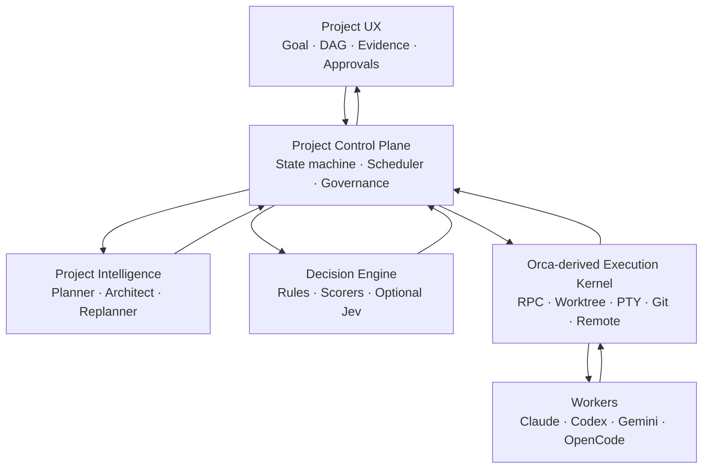
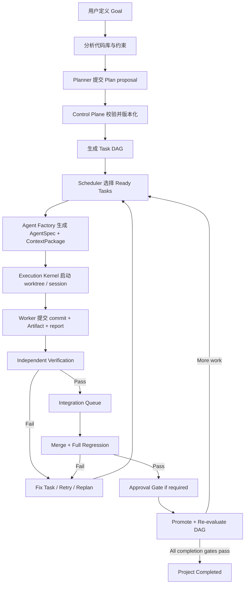

# 自主软件工程控制平台：整体设计 V1

更新日期：2026-09-26  
基础代码审计快照：`stablyai/orca@646e9a5`（Orca 1.4.197）

## 1. 项目定义

本项目是一个**目标驱动的自主软件工程控制平台**。

用户提供项目目标、约束和验收要求，系统负责：

1. 理解项目与现有代码库；
2. 生成并维护版本化实施计划；
3. 将计划转化为带依赖关系的 Task DAG；
4. 为每项任务动态生成 AgentSpec；
5. 调度 Claude Code、Codex、Gemini、OpenCode 等执行者；
6. 管理隔离的 worktree、终端、会话和上下文；
7. 独立验证 Agent 提交的结果；
8. 串行集成通过验证的修改；
9. 在失败、阻塞或需求变化时重新规划；
10. 在高风险节点请求人工决策或批准；
11. 以可恢复、可审计的方式持续推进项目直至完成。

一句话定位：

> 将软件项目目标转化为持久化计划和任务图，动态组织专业 AI Agent，并通过独立验证、受控集成和人工治理完成交付。

## 2. 我们解决的不是“多开几个 Agent”

Orca 已经解决了大量昂贵的执行问题：终端、PTY、Git worktree、Agent CLI、SSH、WSL、远端运行时、进程状态、浏览器和桌面工作台。当前 Orca 还已经包含实验性的 Run、Task、Dispatch、worker、typed message、decision gate 和 federation。

新产品的差异不在“能够启动多个 Agent”，而在**项目级闭环**：

```text
Goal
  → Project Understanding
  → Versioned Plan
  → Task DAG
  → Agent Organization
  → Execution
  → Independent Verification
  → Controlled Integration
  → Replanning
  → Project Completion
```

因此产品不是：

- 多 Agent 聊天室；
- Coding Agent launcher；
- 依赖一个永不退出的 Master Agent；
- 让 Worker 自己宣布完成的自动化脚本；
- 把所有项目上下文塞进同一个 conversation。

## 3. 最高层设计原则

### 3.1 LLM proposes; control plane decides and persists

LLM 负责开放式推理和提出方案；确定性控制平面负责校验、授权、持久化和状态转换。

LLM 不直接：

- 修改权威任务状态；
- 绕过依赖关系；
- 宣布验证通过；
- 合并主分支；
- 自行扩大权限或预算；
- 无限制创建子 Agent。

### 3.2 Task lifetime > Agent lifetime

Task 是长期存在的工作对象；Agent 只是某次 Attempt 的临时执行者。Agent 可以崩溃、重试或从 Claude 换成 Codex，Task 仍保留身份、依赖、验收标准和历史记录。

### 3.3 Worker completion ≠ verified completion

`worker_done` 只表示“提交结果”。完成必须由独立验证器根据测试、静态检查、验收条件、diff 和产物证据判定。

### 3.4 Task DAG，而不是 Agent Tree

系统的权威结构是 Task DAG。Agent 间的父子关系只记录执行来源，不应成为项目结构。Worker 申请子任务时，Control Plane 创建新的 Task 和依赖，再由 Scheduler 分配 Agent。

### 3.5 Typed events，而不是无限聊天

Agent 协作通过结构化消息和 Artifact：`INFORM`、`REQUEST`、`QUESTION`、`DECISION`、`BLOCKED`、`HANDOFF`。人类界面可以呈现为对话，但底层必须可查询、可路由、可去重和可审计。

### 3.6 单一权威写入路径

UI、CLI、LLM 和 Worker 都通过 Runtime RPC 调用 Control Plane。任何模块都不能绕过服务层直接修改编排数据库。

### 3.7 风险分级升级

低风险、高置信度决策走规则或轻量 DecisionEngine；复杂问题交给 specialist LLM；架构变化、权限提升、发布和不可逆操作交给人类。

## 4. 整体架构



### 4.1 Project Experience Layer

面向人的产品界面：

- 创建项目、输入目标与约束；
- 审阅架构和计划；
- 查看 Task DAG、里程碑和实时进度；
- 查看每次 Attempt、Agent 状态、diff 和证据；
- 处理阻塞问题和批准请求；
- 查看验证、集成和重新规划记录；
- 必要时进入终端、编辑器和 Git 工作台。

UI 不是状态权威，只是 Control Plane 的投影和操作入口。

### 4.2 Project Intelligence Layer

由 frontier reasoning model 承担，负责不适合硬编码的开放式工作：

- 需求理解；
- 代码库分析；
- 架构设计；
- 计划与里程碑生成；
- Task DAG proposal；
- 验收标准 proposal；
- 失败根因分析；
- 大范围 replanning；
- 项目完成度的语义审查。

输出必须是 schema-valid proposal，经 Control Plane 校验后才能生效。

### 4.3 Decision Engine

为封闭候选集合提供快速选择、评分、分类和排序：

```ts
interface DecisionEngine {
  choose(input: ChoiceRequest): Promise<ChoiceResult>
  score(input: ScoreRequest): Promise<ScoreResult>
  classify(input: ClassifyRequest): Promise<ClassifyResult>
  rank(input: RankRequest): Promise<RankResult>
}
```

可组合实现：

- deterministic rules；
- heuristics；
- Jev 或类似 typed decision model；
- 小型 classifier；
- frontier LLM fallback。

适合 Agent/provider routing、context ranking、事件路由、是否升级 replanning、风险分级。它不能替代依赖检查、权限判断、测试结果和审批规则。

### 4.4 Project Control Plane

系统的权威核心，负责：

- Project、PlanRevision、Milestone、Task DAG；
- 状态机与合法转换；
- Scheduler 与并发限制；
- Agent Factory；
- Context Package；
- typed message routing；
- Verification orchestration；
- Integration queue；
- Human Approval Gateway；
- budget、permissions、policy；
- crash recovery、retry 和 audit log；
- replanning trigger；
- completion gate。

它主要是确定性代码，不是一个超级 Agent。

### 4.5 Orca-derived Execution Kernel

第一阶段保留和复用：

- `OrcaRuntimeService` 与 Runtime RPC；
- PTY、daemon、terminal persistence；
- Git 和 worktree；
- Agent provider adapters 和 hooks；
- SSH、WSL、relay 和远端运行时；
- agent status；
- 文件、diff、browser/computer 能力；
- Orca 现有 orchestration Run、Task、Dispatch、worker、message、gate 和 federation 生命周期。

Execution Kernel 只回答“在哪里、以什么进程和工作区执行”，不决定项目应该做什么。

### 4.6 Worker Plane

Claude Code、Codex、Gemini、OpenCode 等都是可替换的临时执行者。Worker 接收有限、任务相关的 Context Package，在授权工作区内执行，发布 Artifact、Question、Heartbeat 和 Submission。

## 5. 核心领域对象

| 对象 | 作用 | 权威关系 |
|---|---|---|
| `Project` | 产品级工作空间和最终目标 | 顶层对象，可包含多个 Run/PlanRevision |
| `Goal` | 用户目标、约束、成功标准 | 变更会触发新 PlanRevision |
| `PlanRevision` | 某次被接受的项目计划 | 不覆盖历史版本 |
| `Milestone` | 项目阶段和阶段出口条件 | 聚合 Task，不替代 DAG |
| `Task` | 持久工作单元 | 包含 spec、deps、acceptance criteria、风险与状态 |
| `Attempt/Dispatch` | Task 的一次执行尝试 | 绑定 AgentSpec、workspace、session 和结果 |
| `AgentSpec` | 动态执行角色定义 | role、provider、model、skills、budget、permissions |
| `ContextPackage` | 本次 Attempt 的最小相关上下文 | 文件/Artifact/Decision 的版本化引用 |
| `Artifact` | 可复用、可寻址的输出 | 代码提交、API contract、报告、schema、截图等 |
| `Message/Event` | 结构化协作信息 | 有类型、发送方、接收方、关联对象和 delivery 状态 |
| `Decision` | 架构或执行选择及依据 | 记录 options、resolution、confidence、authority |
| `VerificationRun` | 对不可变提交的独立验收 | 保存命令、输出、criteria 与 verdict |
| `IntegrationBatch` | 一个或多个验证候选的串行集成 | 有 base、候选列表、冲突和回归结果 |
| `Approval` | 人工治理门 | 绑定明确动作、风险和有效期 |
| `AuditEvent` | 不可变的关键行为记录 | 支撑恢复、诊断和合规 |

### 对 Orca 现有对象的映射

| 新产品对象 | Orca 现有基础 | 策略 |
|---|---|---|
| Project / Goal / PlanRevision / Milestone | 无完整对应 | 新增 project tables 和 RPC |
| Task | orchestration Task | 扩展元数据和验收引用，不另建第二套任务系统 |
| Attempt | DispatchContext / worker dispatch | 直接复用和扩展 |
| Worker Session | agent session / terminal | 直接复用 |
| Message | orchestration message/delivery | 扩展类型、Artifact 引用和订阅规则 |
| Approval | decision gate | 泛化为风险动作审批，同时保留 gate 兼容性 |
| VerificationRun | attempt observations 仅有部分证据 | 新增独立实体 |
| IntegrationBatch | 无完整对应 | 新增实体和 integration owner |

## 6. 权威状态机

### 6.1 Project

```text
DRAFT
  → ANALYZING
  → PLANNED
  → EXECUTING
  ↔ REPLANNING
  → INTEGRATING
  → READY_FOR_APPROVAL
  → COMPLETED

任何执行态 → PAUSED / BLOCKED / FAILED / CANCELED
```

### 6.2 Task

为避免破坏 Orca 当前 `pending/ready/dispatched/completed/failed/blocked` 协议，V1 可以保留其执行状态，同时新增独立 delivery stage：

```text
DEFINED
  → READY
  → RUNNING
  → SUBMITTED
  → VERIFYING
  → VERIFIED
  → INTEGRATION_READY
  → INTEGRATED

RUNNING / VERIFYING → NEEDS_FIX → READY
任意未终结态 → BLOCKED / CANCELED
```

Orca 的执行状态负责 Attempt 生命周期；新 delivery stage 负责项目级验收和集成。迁移稳定后再评估是否合并两套投影。

### 6.3 Attempt

```text
CREATED → PLACING → STARTING → RUNNING → SUBMITTED
                    ↘ START_UNKNOWN
RUNNING → FAILED / STOPPED / ABANDONED
SUBMITTED → RELEASED / RETAINED
```

网络或远端失联必须使用 `unverifiable`，不能推断为失败或退出。

### 6.4 Verification

```text
QUEUED → RUNNING → PASS
                 → FAIL
                 → INCONCLUSIVE → SPECIALIST_REVIEW / HUMAN_REVIEW
```

### 6.5 Integration

```text
QUEUED → APPLYING → TESTING → PROMOTABLE → PROMOTED
            ↘ CONFLICT → CONFLICT_TASK
                  TESTING → FAILED → FIX_TASK / REPLAN
```

## 7. 端到端执行流程



## 8. Agent Factory 与调度

Agent Factory 不是“创建一个人格 prompt”，而是将 Task 编译为可执行合同：

```yaml
agentSpec:
  role: Senior Frontend Engineer
  provider: codex
  model: selected-by-policy
  reasoning: high
  capabilities: [react, typescript, accessibility]
  permissions:
    write: [src/frontend/**]
    network: restricted
  budget:
    maxAttempts: 2
    maxRuntimeMinutes: 45
  workspace:
    strategy: new-child-worktree
  contextPackage: ctx_...
  task: task_...
```

选择顺序：

1. 过滤不可用或无权限的执行者；
2. 根据任务 capability、历史表现、成本、延迟和用户偏好评分；
3. 选择 provider/model/reasoning；
4. 记录选择依据和 fallback；
5. 经 Scheduler 获取并发/预算许可；
6. 调用现有 `orchestration.workerStart` / `agent.launch`。

Worker 不能直接 spawn Agent。它只能发出 `REQUEST_SUBTASK`；Control Plane 校验 scope、递归深度、重复工作、成本与依赖后决定是否创建新 Task。

## 9. Context Engineering

Context Package 必须是可寻址、可复现、最小充分的信息集合：

- Task spec 与 acceptance criteria；
- 相关 PlanRevision 和 Decisions；
- 直接依赖任务的 Artifact；
- 精选代码文件和接口；
- repo rules、测试命令和安全约束；
- Agent 的权限和预算；
- 提交与通信协议。

不向 Worker 注入完整项目历史或其他 Agent 的 conversation。Decision Engine 可以做候选 context ranking，但最终必须通过确定性规则加入强制文件、权限约束和 token budget。

## 10. 通信模型

基础消息类型：

| 类型 | 用途 | 典型接收者 |
|---|---|---|
| `INFORM` | 状态或兼容性变化 | 受影响任务/订阅者 |
| `REQUEST` | 请求资源、权限或子任务 | Control Plane |
| `QUESTION` | 阻塞性问题 | 指定 Agent、specialist 或人类 |
| `DECISION` | 决策及依据 | 依赖该决策的任务 |
| `BLOCKED` | 无法继续执行 | Coordinator/ProjectController |
| `HANDOFF` | 产物和责任交接 | 下游 Task/Agent |
| `SUBMISSION` | Worker 提交结果 | Verification Queue |

路由以对象关系和订阅为主、Decision Engine 评分为辅，不全局广播。消息正文只放摘要，详细内容放在 Artifact 中。

## 11. Verification 设计

验证器必须独立于实现 Worker，并绑定一个不可变候选（commit SHA、tree hash 或可验证 patch）。验证层包括：

1. **Deterministic checks**：测试、lint、typecheck、build、迁移检查、安全扫描；
2. **Acceptance checks**：逐条核对验收条件；
3. **Diff inspection**：scope、危险改动、遗漏测试、生成文件；
4. **Artifact inspection**：contract、截图、报告和输出是否完整；
5. **LLM review**：仅用于语义和开放式审查；
6. **Escalation**：结果不一致或低置信度时交给 specialist/human。

Verifier 不能只读取 Worker 的总结。所有 verdict 必须保存证据、工具版本、命令、输出摘要和目标 commit。

## 12. Integration 与发布治理

并行 worktree 不能直接各自合并。所有通过验证的候选进入单一 Integration Queue：

- 一个 integration owner 串行处理；
- 明确 batch base 和候选顺序；
- 检测冲突和跨任务语义不兼容；
- 在合并后的树上执行全量回归；
- 失败时生成 conflict/fix Task；
- 高风险迁移、权限变化、部署和 release 必须经过 Approval；
- 只有 promoted 结果才能计入项目完成度。

## 13. Replanning 机制

Replanning 不是每完成一个 Task 就重新规划整个项目。触发器分级：

- **No replan**：普通成功或局部可自动修复失败；
- **Minor adjustment**：更新 Task、依赖、AgentSpec 或 ContextPackage；
- **Major replan**：架构假设失效、目标变化、连续失败、关键依赖不可用、集成冲突扩大。

Decision Engine 可先评估 `NO / MINOR / MAJOR`；Major 必须由 Project Intelligence 生成新 PlanRevision。旧版本保留，不原地覆盖。

## 14. Human Governance

人工参与集中在少数高价值节点：

- 接受最初架构/计划（可配置自动接受）；
- 需求歧义和产品选择；
- 权限或预算提升；
- 数据迁移、删除和不可逆操作；
- 安全敏感改动；
- 发布、部署和主分支 promotion；
- 多次自动修复仍失败；
- 系统无法给出高置信度判断。

Approval 必须绑定具体 action、输入摘要、风险、有效期和执行结果，不能只保存一句“批准了”。

## 15. 产品界面

### Primary surfaces

1. **Project Home**：目标、总体状态、进度、风险、下一步；
2. **Plan & DAG**：计划版本、里程碑、任务依赖和 critical path；
3. **Task Detail**：spec、criteria、AgentSpec、Attempt、Artifact 和验证；
4. **Agent Fleet**：运行中 Agent、工作区、成本、状态和阻塞；
5. **Verification & Integration**：验证队列、集成批次、冲突和回归；
6. **Decisions & Approvals**：决策历史和待处理审批；
7. **Developer Workbench**：终端、编辑器、diff、浏览器和日志。

首页围绕 Project，而不是 worktree。终端与 IDE 仍然重要，但成为可钻取的执行视图。

## 16. 源码改造策略

### KEEP AS EXECUTION KERNEL

- terminal / PTY / daemon / orcad；
- Git / worktree / source control；
- provider adapters / agent hooks；
- SSH / WSL / relay；
- Runtime RPC / CLI client；
- agent status；
- 现有 orchestration Run/Task/Dispatch/worker/message/gate/federation；
- editor、diff、terminal、browser 工作台。

### MODIFY

- orchestration schema：增加 Project、PlanRevision、Milestone、VerificationRun、IntegrationBatch、Approval 等；
- orchestration RPC：增加 project/plan/verify/integrate/approval 方法；
- worker start：接收 AgentSpec、ContextPackage、budget 和 permission policy；
- messaging：增加 Artifact 引用、事件订阅与结构化语义；
- dashboard/sidebar/app shell：改为 Project-first；
- CLI/skills：增加完整项目控制命令。

### REPLACE OR HIDE

- Orca 品牌、图标、产品文案和 onboarding；
- 原 app ID、bundle ID、CLI 品牌和安装器名称；
- 原 updater、telemetry、crash endpoint 和发布源；
- V1 隐藏非核心外部工单 UI；GitHub/PR 能力按集成需求保留；
- cloud/mobile 暂不作为 V1 依赖，后续单独评估。

### Control Plane 插入点

```text
Project UI / CLI
  → Runtime RPC method registry
  → ProjectController service
  → orchestration DB transaction
  → scheduler / verification / integration services
  → existing workerStart / agentLaunch / worktree / terminal
```

Renderer 不直接启动 shell 或写 DB；Project Intelligence 和 Decision Engine 也只通过受限接口提交 proposal。

## 17. V1 产品边界

### V1 必须有

- 单个本地 Git 项目的 Goal 创建；
- repo analysis 和人工可审阅的 PlanRevision；
- Task DAG 与 acceptance criteria；
- Claude/Codex/Gemini/OpenCode 中至少三种执行者；
- 动态 AgentSpec 和最小 ContextPackage；
- 并行 worktree 执行；
- typed status/question/submission；
- 独立 deterministic verification；
- 单一 integration owner；
- conflict/fix loop；
- 关键操作人工批准；
- 崩溃重启后的状态恢复；
- Project-first UI 和执行工作台钻取。

### V1 暂不做

- 多用户 SaaS tenancy；
- 移动端；
- 大规模云端 agent fleet；
- 自动生产部署；
- 无边界递归 Agent；
- 让 Jev 成为硬依赖；
- 复杂 marketplace；
- 完全无人监督的软件发布。

## 18. 实施路线

### M0：Fork 与品牌/网络隔离

新产品身份、签名、更新源、telemetry、图标、Third-Party Notices；确保不向原 Orca 产品服务发送数据。

### M1：Project Facade

Project/Goal/PlanRevision/Milestone 与现有 Run/Task 映射；重启恢复；Project-first 基础 UI。

### M2：Planning 与 Agent Factory

结构化 plan proposal、DAG 校验、AgentSpec、ContextPackage、provider routing 与预算。

### M3：Independent Verification

Submission、VerificationRun、不可变候选、deterministic checks、失败重试和证据视图。

### M4：Controlled Integration

Integration Queue、single owner、合并后全量测试、冲突任务、Approval 和 promotion。

### M5：Replanning 与 Decision Engine

minor/major replan、DecisionEngine abstraction、Jev 实验、历史表现和成本反馈。

### M6：Remote 与扩展产品能力

验证远端 mixed-version、SSH/WSL/federation，之后再决定 cloud、mobile、多用户和托管执行。

## 19. V1 成功标准

选择一个中等规模真实代码库，用户只输入目标和约束。系统必须能够：

1. 生成可审阅计划和合法 DAG；
2. 并行启动至少三个不同 provider 的 Worker；
3. 在 Agent 崩溃后恢复或安全重试；
4. 拒绝把仅有 `worker_done`、没有验证证据的任务标记为可集成；
5. 捕获一个故意引入的测试失败并创建修复循环；
6. 处理两个单独通过但合并后冲突的候选；
7. 在集成树上跑完整回归；
8. 对高风险 promotion 请求人工批准；
9. 重启应用后保留 Project、Task、Attempt、Decision、Evidence 和 Approval；
10. 给出“为什么项目已完成”的证据，而不是只显示所有 Agent 已停止。

## 20. 最终架构判断

项目的正确形态不是：

```text
Master Agent → many Workers
```

而是：

```text
Project Intelligence proposes
        ↓
Control Plane validates, persists and governs
        ↓
Decision Engine selects fast paths
        ↓
Orca-derived Kernel executes and observes
        ↓
Workers submit evidence
        ↓
Independent Verification accepts or rejects
        ↓
Integration Controller promotes
        ↓
Human approves risk, not routine
```

真正的产品护城河不是同时运行多少 Agent，而是把长期软件项目的**计划、执行、证据、决策、验证、集成和治理**连接成一个可靠闭环。
